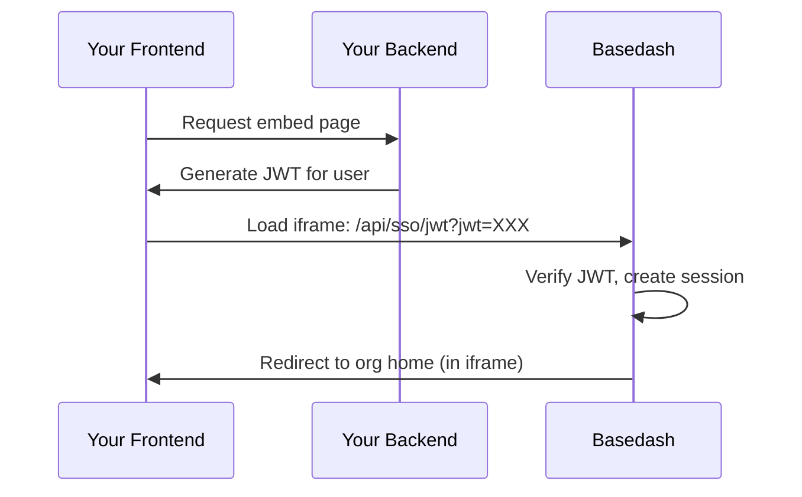

Basedash supports two types of embedding:

- **Dashboard embedding**: Embed a dashboard as a read-only, interactive view in an iframe.
- **Full app embedding**: Embed the full Basedash app (dashboards + chat) inside your product with JWT SSO.

## Dashboard embedding

Dashboard embedding is best when you want to show a specific dashboard inside another app.

### Create an embed

1. Open the dashboard in Basedash
2. Click **Share** in the dashboard header
3. Enable the **Embedding** toggle
4. Copy the iframe snippet (or copy the plain URL)

Embeds use a share link with the `/shared/{id}` path.

```html
<iframe
  src="https://charts.basedash.com/shared/xyz789"
  width="100%"
  height="600"
  frameborder="0"
  allowfullscreen
></iframe>
```

### Show or hide dashboard filters

In the share dialog, you can configure whether dashboard filters are visible in the embed. This is useful when you want a clean, fixed view (hidden filters) versus an explorable view (shown filters).

## Full app embedding

Full app embedding lets you embed the entire Basedash experience inside your product. Your users can view dashboards, build new charts, and chat with the AI assistant—all without leaving your application.

This is ideal for customer portals, partner dashboards, or any scenario where you want to give users a complete BI experience powered by their own data.

### How it works

Full app embedding uses JWT-based single sign-on (SSO) inside an iframe:

1. **Your server generates a JWT** containing the user's identity and your Basedash organization ID
2. **The iframe loads the SSO endpoint** (`/api/sso/jwt?jwt=...`) with the token
3. **Basedash validates the JWT** against your organization's secret
4. **A session is created** for the user (creating their account if needed)
5. **The user is redirected** to your organization's home page inside the iframe



### Setup overview

Setting up full app embedding involves these steps:

1. Enable embedding and get your JWT secret
2. Generate JWTs server-side for your users
3. Load the iframe with the SSO URL

### Step 1: Enable embedding

Enable embedding for your organization by going to **Settings → Embedding → Enable full app embedding**. Once enabled, you can copy your JWT secret from this page. The JWT secret is used to sign tokens that authenticate users into the embedded app.

<Warning>
  Store your `jwtSecret` securely in your environment variables. Never expose it
  in client-side code.
</Warning>

You can also configure allowed origins on this page to restrict which domains can embed your organization.

### Step 2: Generate JWTs server-side

Your backend must generate a signed JWT for each user who accesses the embed. Here are examples in common languages:

<CodeGroup>

```javascript Node.js
import jwt from "jsonwebtoken";

function generateBasedashToken(user) {
  return jwt.sign(
    {
      email: user.email,
      orgId: process.env.BASEDASH_ORG_ID,
      firstName: user.firstName,
      lastName: user.lastName,
      role: "MEMBER", // or 'ADMIN'
    },
    process.env.BASEDASH_EMBED_JWT_SECRET,
    { expiresIn: "10m" },
  );
}

// Express route example
app.get("/embed/basedash", (req, res) => {
  const token = generateBasedashToken(req.user);
  const embedUrl = `https://charts.basedash.com/api/sso/jwt?jwt=${token}`;

  res.render("embed", { embedUrl });
});
```

```python Python
import jwt
import os
from datetime import datetime, timedelta

def generate_basedash_token(user):
    payload = {
        'email': user.email,
        'orgId': os.environ['BASEDASH_ORG_ID'],
        'firstName': user.first_name,
        'lastName': user.last_name,
        'role': 'MEMBER',
        'exp': datetime.utcnow() + timedelta(minutes=10),
        'iat': datetime.utcnow(),
    }
    return jwt.encode(
        payload,
        os.environ['BASEDASH_EMBED_JWT_SECRET'],
        algorithm='HS256'
    )

# Flask route example
@app.route('/embed/basedash')
def basedash_embed():
    token = generate_basedash_token(current_user)
    embed_url = f'https://charts.basedash.com/api/sso/jwt?jwt={token}'
    return render_template('embed.html', embed_url=embed_url)
```

```ruby Ruby
require 'jwt'

def generate_basedash_token(user)
  payload = {
    email: user.email,
    orgId: ENV['BASEDASH_ORG_ID'],
    firstName: user.first_name,
    lastName: user.last_name,
    role: 'MEMBER',
    exp: 10.minutes.from_now.to_i,
    iat: Time.now.to_i
  }
  JWT.encode(payload, ENV['BASEDASH_EMBED_JWT_SECRET'], 'HS256')
end

# Rails controller example
def basedash_embed
  token = generate_basedash_token(current_user)
  @embed_url = "https://charts.basedash.com/api/sso/jwt?jwt=#{token}"
end
```

```go Go
import (
    "os"
    "time"
    "github.com/golang-jwt/jwt/v5"
)

func generateBasedashToken(user User) (string, error) {
    claims := jwt.MapClaims{
        "email":     user.Email,
        "orgId":     os.Getenv("BASEDASH_ORG_ID"),
        "firstName": user.FirstName,
        "lastName":  user.LastName,
        "role":      "MEMBER",
        "exp":       time.Now().Add(10 * time.Minute).Unix(),
        "iat":       time.Now().Unix(),
    }

    token := jwt.NewWithClaims(jwt.SigningMethodHS256, claims)
    return token.SignedString([]byte(os.Getenv("BASEDASH_EMBED_JWT_SECRET")))
}
```

</CodeGroup>

### Step 3: Load the iframe

In your frontend, render an iframe pointing to the SSO URL:

```html
<iframe
  src="https://charts.basedash.com/api/sso/jwt?jwt=YOUR_JWT_TOKEN"
  width="100%"
  height="800"
  frameborder="0"
></iframe>
```

### Customization options

You can customize the appearance of the embedded app by appending query parameters to the SSO URL:

```html
<iframe
  src="https://charts.basedash.com/api/sso/jwt?jwt=YOUR_JWT_TOKEN&theme=dark&hide_org_name=true"
  width="100%"
  height="800"
  frameborder="0"
></iframe>
```

| Parameter                | Values                  | Default | Description                                                                 |
| ------------------------ | ----------------------- | ------- | --------------------------------------------------------------------------- |
| `theme`                  | `light`, `dark`, `auto` | `auto`  | Override the theme for the embedded app. `auto` uses the system preference. |
| `hide_org_name`          | `true`                  | `false` | Hide the organization name in the sidebar                                   |
| `hide_suggested_prompts` | `true`                  | `false` | Hide the suggested prompts in the AI chat input                             |

### JWT claims reference

Your JWT must include these claims:

| Claim       | Type   | Required | Description                                |
| ----------- | ------ | -------- | ------------------------------------------ |
| `email`     | string | Yes      | The user's email address                   |
| `orgId`     | string | Yes      | Your Basedash organization ID              |
| `exp`       | number | Yes      | Expiration timestamp (Unix seconds)        |
| `iat`       | number | Yes      | Issued-at timestamp (Unix seconds)         |
| `firstName` | string | No       | User's first name                          |
| `lastName`  | string | No       | User's last name                           |
| `role`      | string | No       | `ADMIN` or `MEMBER` (defaults to `MEMBER`) |

<Note>
  The `role` claim is only used when creating new members. It doesn't change the
  role of existing members.
</Note>

### Allowed origins

For security, you can restrict which domains can embed your Basedash organization. Configure this at **Settings → Embedding**

You can add specific origins (e.g., `https://app.example.com`) or use wildcard patterns to allow all subdomains of a domain (e.g., `https://*.example.com`).

<Note>
  Wildcard patterns must include a full domain name. Overly broad patterns like
  `https://*.com` are not allowed.
</Note>

If no origins are configured, embeds are allowed from any domain.

### Security best practices

<AccordionGroup>

<Accordion title="Keep your JWT secret secure">
  Never expose the `jwtSecret` in client-side code. Generate JWTs only on your
  backend.
</Accordion>

<Accordion title="Use short token expiration">
  JWTs should expire within 10-60 minutes. Users only need a valid token when
  loading the iframe—once authenticated, they use a Basedash session cookie.
</Accordion>

<Accordion title="Configure allowed origins">
  Always set `embedAllowedOrigins` in production to prevent unauthorized sites
  from embedding your organization.
</Accordion>

<Accordion title="Use read-only database credentials">
  When connecting data sources, use database credentials with read-only
  permissions to minimize risk.
</Accordion>

<Accordion title="Validate user access server-side">
  Before generating a JWT, verify that the current user should have access to
  the embedded analytics.
</Accordion>

</AccordionGroup>

### Troubleshooting

<AccordionGroup>

<Accordion title="Missing JWT parameter">
**Error**: "The embed URL is missing the required JWT token"

Make sure your iframe `src` includes the `?jwt=` query parameter with your signed token.

</Accordion>

<Accordion title="Embedding not enabled">
**Error**: "Embedding is not enabled for this organization"

Enable embedding when creating the organization by setting `fullEmbedEnabled: true`, or update an existing organization via the API.

</Accordion>

<Accordion title="Origin not allowed">
**Error**: "This embed is not authorized to load from [origin]"

Add your domain to the `embedAllowedOrigins` array. You can add a specific origin (e.g., `https://app.example.com`) or use a wildcard pattern to allow all subdomains (e.g., `https://*.example.com`).

</Accordion>

<Accordion title="Authentication failed (invalid or expired JWT)">
**Error**: "The JWT token is invalid or has expired"

- Verify you're using the correct `jwtSecret` for the organization
- Check that the JWT hasn't expired (tokens should be short-lived)
- Ensure you're signing with the HS256 algorithm
- Verify the clock on your server is accurate (JWT validation allows 30 seconds of clock skew)

</Accordion>

<Accordion title="Missing Referer header">
**Error**: "Unable to verify the request origin"

This happens when allowed origins are configured but the browser doesn't send a Referer header. Check that:

- Your page doesn't have `Referrer-Policy: no-referrer`
- You're not loading the iframe from a `file://` URL during development

</Accordion>

<Accordion title="Organization not found">
**Error**: "The organization ID in your JWT does not match any Basedash organization"

Verify that the `orgId` claim in your JWT matches an existing Basedash organization ID.

</Accordion>

</AccordionGroup>

## Related pages

- [API reference](/api-reference/overview)
- [Filters and variables](/features/filters-and-variables)
- [Dashboards](/features/dashboards)
- [Chat](/features/chat)
